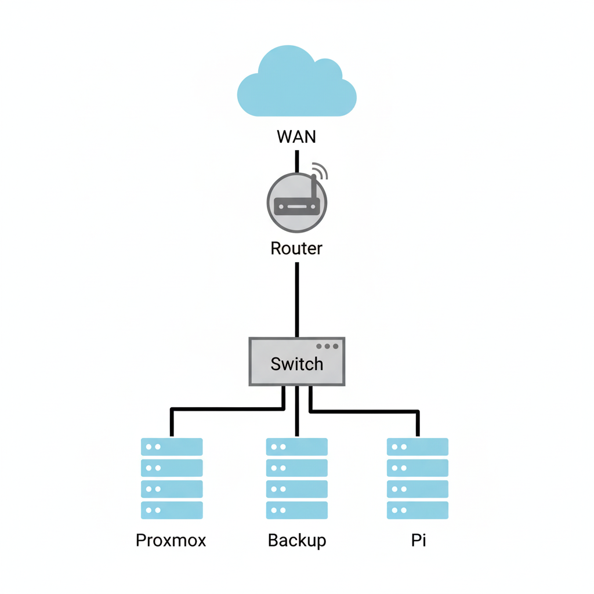
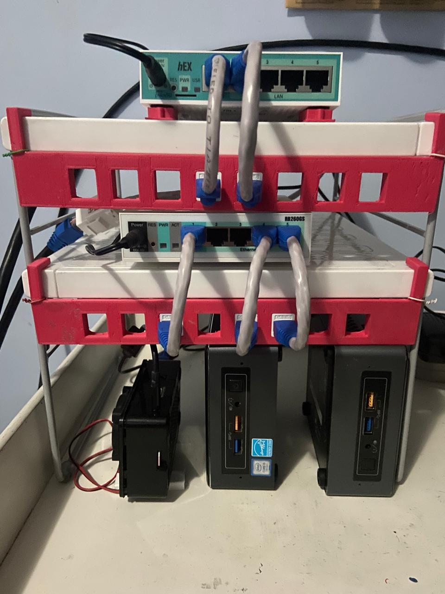

# Homelab Core Rack

This repository documents the core rack of my personal homelab: a compact, low-power setup built around MikroTik networking gear and three small servers (two Intel NUCs and a Raspberry Pi 3 B+).  

The goal is to keep a clean, versioned record of the network and host configurations and use this project as a portfolio-ready example of my networking and virtualization skills.

> **Scope:** This repo focuses on the **core infrastructure** (router, switch, hypervisor, backup server, and monitoring node on the Raspberry Pi).  
> Any **security testing, vulnerability analysis, or offensive security labs** will live in **separate repositories** that reference this one as the base environment.

---

## 1. Hardware Overview

| Device                           | Specs                                                                                     | OS          | Purpose                                                     |
|----------------------------------|-------------------------------------------------------------------------------------------|-------------|-------------------------------------------------------------|
| MikroTik hEX RB750Gr3           | 5× Gigabit Ethernet ports, hardware NAT, low power consumption                           | RouterOS    | Edge router, gateway, basic firewall and routing           |
| MikroTik RB260GS (CSS106-5G-1S) | 5× Gigabit Ethernet ports, 1× SFP cage populated with MikroTik S-RJ01 1.25 Gbps RJ45 SFP | SwOS        | Core Layer 2 switch for the rack                           |
| Intel NUC i5                    | 7th Gen Intel i5 CPU, 32 GB DDR4, 1 TB SSD/HDD, 16 GB Intel Optane                       | Proxmox VE  | Main hypervisor for virtual machines and containers        |
| Intel NUC Celeron               | Celeron CPU, 4 GB DDR3, 250 GB SSD, 1 TB external USB HDD                                | Alpine Linux| Backup / utility server, additional storage and services   |
| Raspberry Pi 3 B+               | Quad-core ARM CPU, ~2 GB RAM, 32 GB SSD (root filesystem)                                | DietPi      | Monitoring node (metrics, logging, observability services) |

---

## 2. Cabling

The rack uses structured cabling based on **Cat 6**:

- **Cat 6 FTP (shielded)** from the ISP router to the MikroTik hEX router, to reduce interference on the external/edge segment.
- **Cat 6 UTP** for internal links between the router, switch, and servers.
- Patch panels and keystone terminations use **Cat 6-rated jacks**.
- All copper runs are terminated using the **TIA/EIA-568B** wiring standard.

The STL models for the custom patch panels used in this rack are stored in the [`docs/`](./docs/) directory.

---

## 3. Network Topology

### 3.1 Logical Topology

The core lab currently uses a single private subnet:

- **Subnet:** `172.16.0.0/24`

| Name      | Role       | Device                           | IP Address      |
|----------|------------|----------------------------------|-----------------|
| `router` | Gateway    | MikroTik hEX RB750Gr3            | `172.16.0.1/24` |
| `switch` | Core L2    | MikroTik RB260GS (CSS106-5G-1S)  | `172.16.0.2/24` |
| `backup` | Server     | Intel NUC Celeron                | `172.16.0.3/24` |
| `proxmox`| Hypervisor | Intel NUC i5                     | `172.16.0.4/24` |
| `pi`     | Monitoring | Raspberry Pi 3 B+                | `172.16.0.5/24` |

Future extensions (VLANs, additional subnets, lab networks, etc.) will also be documented here and in the device-specific READMEs.

### 3.2 Physical Topology

The physical layout follows a simple SOHO-style stack inside a small rack:

- ISP router → MikroTik hEX (edge router).
- MikroTik hEX → MikroTik RB260GS switch (Cat 6 FTP on the WAN side, Cat 6 UTP internally).
- All servers (Proxmox NUC, backup NUC, Raspberry Pi) are cabled to the RB260GS.
- One SFP cage is populated with a **MikroTik S-RJ01 copper RJ45 SFP** module for flexible connectivity.

Infraestructure Diagram:



Infraestructure Photo:



---

## 4. Repository Layout

Planned directory structure:

```text
homelab-core-rack/
├── README.md                       # Overview, hardware, cabling, and topology
├── docs/
│   └── (Pictures and extra files)
├── router-mikrotik-hex-rb750gr3/
│   └── README.md                   # Router configuration and design notes
├── switch-mikrotik-rb260gs/
│   └── README.md                   # SwOS configuration, VLANs, management
├── server-proxmox-nuc-i5/
│   └── README.md                   # Proxmox networking, storage, VM layout
├── server-backup-nuc-alpine/
│   └── README.md                   # Alpine services, backup strategies, mounts
├── server-rpi3bplus-dietpi/
│   └── README.md                   # Monitoring stack and DietPi configuration
└── .gitignore
```

Each device-specific directory will contain:

- A short description of the node’s role in the lab.
- Sanitized configuration snippets (no secrets).
- Notes about design decisions and future improvements.

---

## 5. Docs (extra files)

The [`docs/`](./docs/) directory is intended for assets that complement the homelab documentation, such as:

- **3D models (STL)** for custom patch panels and rack accessories.
- Any auxiliary diagrams, templates, or scripts that are not strictly configuration but are relevant to the physical build.
- Referenced pictures/photos.

---

## 6. License

Configuration examples and files are shared for **educational and portfolio** purposes only.  
Do **not** copy them directly into production environments without proper review and hardening.
