# Router Mikrotik hEX RB750Gr3

## A. Basic Configuration

### 1. General configuration

#### 1.1 Initial connection using MAC address

To perform the very first configuration, the router was accessed from a Windows laptop using **WinBox** and the device’s **MAC address** instead of its IP.  
This avoids any dependency on the default IP configuration and works even if the IP addressing has not yet been set.

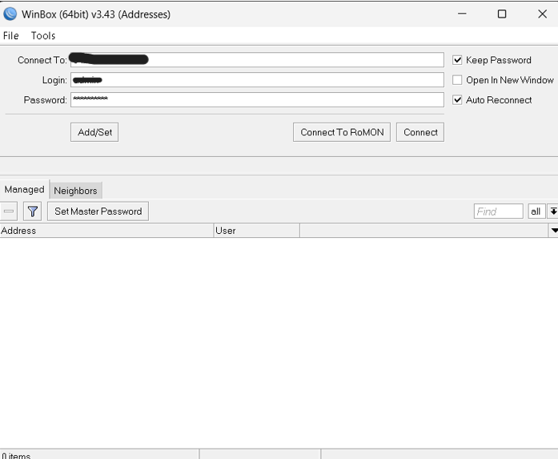

**Figure 1 – Initial connection via MAC address**  
WinBox is used to connect to the router by selecting the device from the “Neighbors” tab and authenticating with the default admin credentials.

---

#### 1.2 Reviewing the factory default configuration

After the first login, RouterOS displays the **Default Configuration** window.  
Here you can see the vendor’s preset configuration, which typically includes a basic WAN–LAN setup, a DHCP server on the LAN bridge, firewall rules, and NAT.

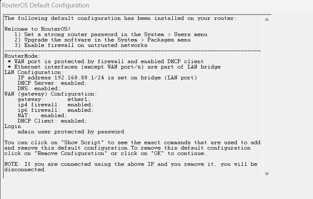

**Figure 2 – Factory default configuration**  
The summary shows that ether1 is used as the WAN port and the remaining Ethernet interfaces are part of a pre-configured LAN bridge with DHCP and firewall enabled.

---

#### 1.3 Securing access credentials

Right after confirming the default configuration, the **admin** account password is changed and stored in WinBox’s address list for easier management.

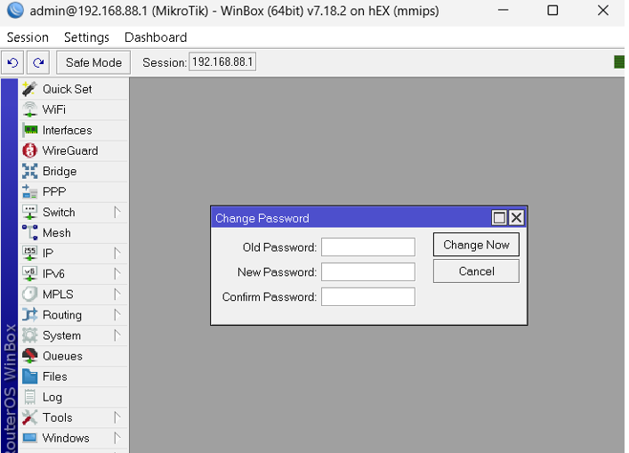

**Figure 3 – Credentials and management entry**  
The router’s management IP/MAC, username, and password are saved in WinBox with **Keep Password** and **Auto Reconnect** enabled, while the default admin password is replaced by a strong one on the device.

---

### 2. Bridge configuration

This section groups all steps related to creating the LAN bridge, attaching ports, and assigning the LAN IP/network.

#### 2.1 Creating the LAN bridge

A dedicated bridge called **`bridge-lan`** is created to aggregate the internal LAN interfaces.  
This bridge will later include all LAN ports (ether2–ether5), keeping **ether1** reserved for the WAN/Internet uplink.

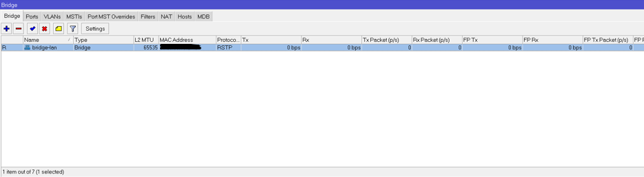

**Figure 4 – Creating a bridge interface**  
From the *Interfaces* menu, the **Bridge** type is selected to create a new logical interface that will act as the LAN bridge.

**Figure 5 – bridge-lan created**  
The new `bridge-lan` interface appears in the *Bridge* menu with RSTP enabled, ready to receive member ports.

---

#### 2.2 Adding LAN ports to the bridge

All internal LAN ports (**ether2**, **ether3**, **ether4**, **ether5**) are added as **bridge ports** to `bridge-lan`.  
The WAN port (**ether1**) is intentionally left **outside** the bridge so it can be used as the Internet uplink.

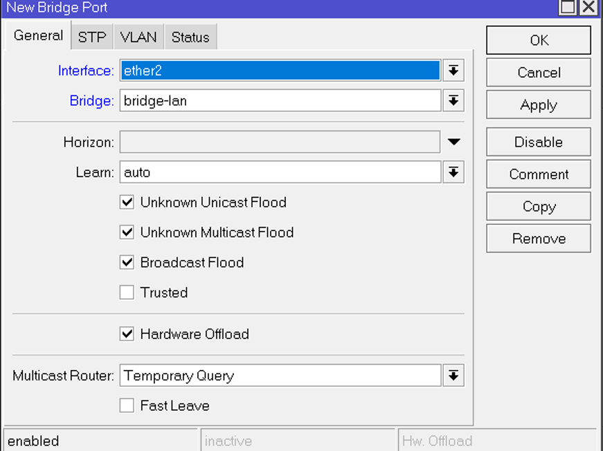

**Figure 6 – Adding ports to the bridge**  
Each Ethernet interface is attached to `bridge-lan` using the *Bridge Port* configuration, keeping hardware offload enabled for better performance.

---

#### 2.3 Verifying bridge results

After all LAN interfaces have been added, the *Ports* tab of the Bridge menu shows `bridge-lan` with **ether2–ether5** as member ports.  
This confirms that all internal switch ports now belong to the same LAN segment, while ether1 remains separate for WAN/Internet.

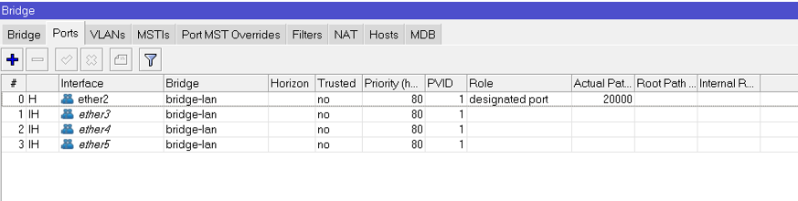

**Figure 7 – Final bridge configuration**  
The bridge port table lists each LAN port (ether2–ether5) as a designated port on `bridge-lan`, completing the basic LAN aggregation.

---

#### 2.4 Assigning LAN IP address and network

The LAN gateway address is configured directly on the `bridge-lan` interface, defining the router’s IP and the associated network for the internal segment.

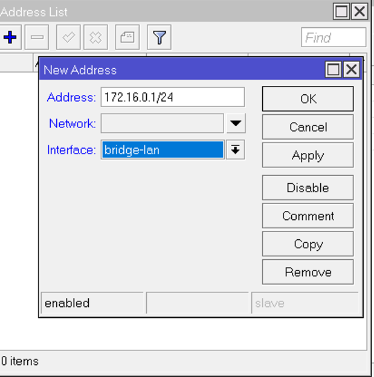

**Figure 8 – Setting IP address on bridge-lan**  
Address `172.16.0.1/24` is added on interface `bridge-lan`, which will serve as the default gateway for all LAN clients.

**Figure 9 – Address list overview**  
The *Address List* now shows the `172.16.0.1/24` network bound to `bridge-lan`, confirming that the LAN IP configuration is active.

---

### 3. DHCP configuration

A dedicated DHCP server is configured on `bridge-lan` so that all devices connected to the LAN ports receive IP addresses, gateway, and DNS settings automatically.

#### 3.1 Selecting the DHCP interface

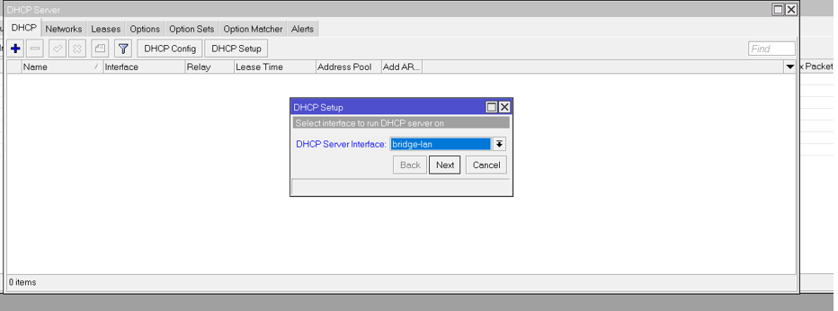

**Figure 10 – Choosing the DHCP server interface**  
In the DHCP Setup wizard, `bridge-lan` is selected as the interface on which the DHCP server will operate.

---

#### 3.2 Defining the DHCP address space and gateway

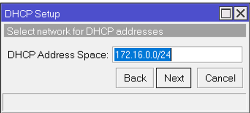

**Figure 11 – DHCP address space**  
The DHCP scope is defined for the `172.16.0.0/24` network, matching the IP configuration of `bridge-lan`.

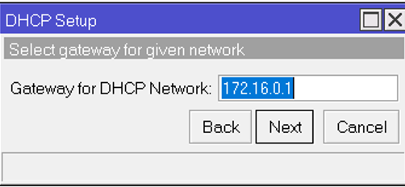

**Figure 12 – DHCP gateway configuration**  
The router’s LAN IP `172.16.0.1` is set as the **Gateway for DHCP Network**, so clients use it as their default route.

---

#### 3.3 Defining the DHCP pool range

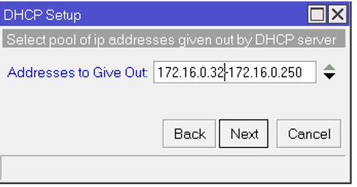

**Figure 13 – DHCP pool range**  
The wizard is configured to distribute addresses in the range `172.16.0.32–172.16.0.250`, leaving lower addresses available for static assignments (servers, infrastructure, etc.).

---

#### 3.4 Configuring DNS servers for clients

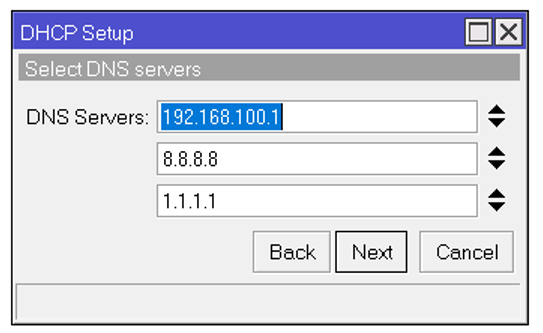

**Figure 14 – DHCP DNS configuration**  
DNS servers provided to clients include the upstream router (`192.168.100.1`) and two public resolvers (`8.8.8.8` and `1.1.1.1`) as fallbacks.

---

#### 3.5 DHCP lease time

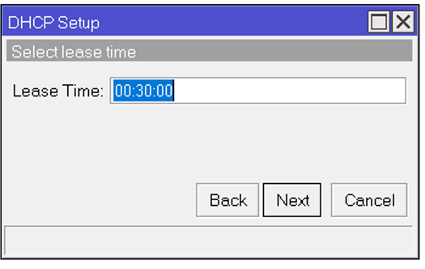

**Figure 15 – DHCP lease time**  
The default lease time is set to **30 minutes**, ensuring that unused addresses return quickly to the pool in this lab environment.

---

### 4. NAT configuration

> **Note:** NAT configuration will be documented here using the same structure (screenshots, description, and figure captions) once the outbound masquerade and any additional NAT rules are defined on the router.
