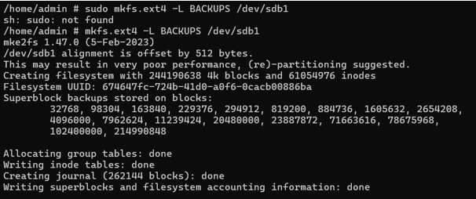
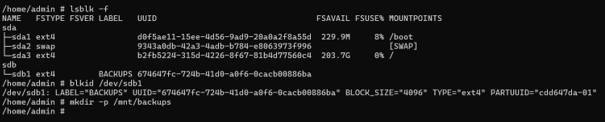
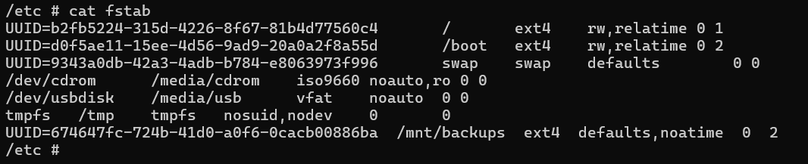
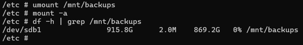
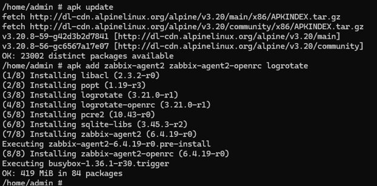
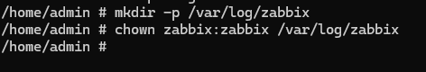
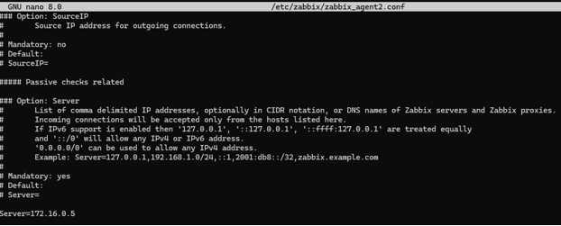
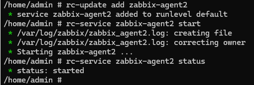

# Backup Server Intel NUC Celeron (Alpine)

# A. Backup Disk Mount Configuration

### 1. Identifying and formatting the backup disk

The backup server uses a dedicated secondary disk to store long‑term backups.  
Before formatting or mounting, the system’s block devices are inspected to ensure the correct disk (`/dev/sdb1`) is being used.

---


#### 1.1 Creating an ext4 filesystem for backups

```bash
mkfs.ext4 -L BACKUPS /dev/sdb1
```



**Figure 6 – Formatting /dev/sdb1 as ext4**  
This command creates a fresh ext4 filesystem labeled `BACKUPS`.  
The output shows the creation of superblocks, inodes and journal, confirming the filesystem is ready for use.

---

#### 1.2 Listing available disks and partitions

```bash
lsblk -f
blkid /dev/sdb1
```



**Figure 5 – Identifying the backup disk `/dev/sdb1`**  
The `lsblk -f` command displays all detected block devices along with their filesystem type, labels and mountpoints.  
`blkid` confirms the UUID and filesystem metadata for `/dev/sdb1`, ensuring you are operating on the correct partition.


---

### 2. Creating the mount point and mounting the filesystem

A dedicated directory (`/mnt/backups`) is created to serve as the mount point for the disk where all backup data will be stored.

---

#### 2.1 Creating the mount directory and mounting the disk

```bash
mkdir -p /mnt/backups
mount /dev/sdb1 /mnt/backups
```


**Figure 7 – Mounting the BACKUPS filesystem**  
Once mounted, the full capacity of the ext4 filesystem becomes available under `/mnt/backups`, allowing backup scripts and services to store data safely.

---

### 3. Persisting the mount in `/etc/fstab`

To ensure the backup disk mounts automatically on every boot, an entry referencing its UUID is added to `/etc/fstab`.

---

#### 3.1 Editing `/etc/fstab`

```text
UUID=674647fc-724b-41d0-a0f6-0cacb00886ba  /mnt/backups  ext4  defaults,noatime  0  2
```



**Figure 8 – Adding BACKUPS to fstab**  
Using the UUID guarantees that the correct disk is mounted even if the kernel assigns a different name (e.g., `/dev/sdc` instead of `/dev/sdb`).

---

#### 3.2 Testing fstab

```bash
umount /mnt/backups
mount -a
df -h | grep /mnt/backups
```



**Figure 9 – Verifying automatic mounting**  
Running `mount -a` tests the fstab entry for errors.  
If successful, `df -h` will show `/dev/sdb1` mounted again at `/mnt/backups`.

---

### 4. Securing ownership and permissions

By default, the mount point is owned by root.  
To allow the `admin` user to write backups securely, ownership and permissions must be adjusted.

---

#### 4.1 Setting directory ownership and permissions

```bash
chown admin:admin /mnt/backups
chmod 750 /mnt/backups
```


**Figure 10 – Restricting access to backups**  
`chmod 750` ensures:  
- **admin** (owner) → full control  
- **admin group** → read & execute  
- **others** → no access  
This keeps backup data protected from other local users.

---


## B. Zabbix Agent Configuration

### 1. Installing Zabbix Agent 2 on Alpine

This Intel NUC Celeron runs Alpine Linux and acts as the backup server in the homelab.  
To integrate it into the Zabbix monitoring stack, **Zabbix Agent 2** is installed and configured to report to the DietPi Zabbix server at `172.16.0.5`.

---

#### 1.1 Updating repositories and installing the agent

First, the Alpine package indexes are updated and the Zabbix Agent 2 packages are installed together with `logrotate` and the OpenRC service files.

```bash
apk update
apk add zabbix-agent2 zabbix-agent2-openrc logrotate
```



**Figure 11 – Installing Zabbix Agent 2 on Alpine**  
The command `apk add` pulls `zabbix-agent2`, its OpenRC integration and the required libraries, preparing the system to run the agent as a managed service.

---

#### 1.2 Creating the log directory for Zabbix

By default, the agent expects a writable log directory under `/var/log/zabbix`.  
On this Alpine installation the directory is created manually and ownership is given to the `zabbix` user:

```bash
mkdir -p /var/log/zabbix
chown zabbix:zabbix /var/log/zabbix
```



**Figure 12 – Preparing the Zabbix log directory**  
This ensures that `zabbix-agent2` can create and rotate its own log files without permission issues.

---

### 2. Configuring Zabbix Agent 2

The main configuration file is `/etc/zabbix/zabbix_agent2.conf`.  
At minimum, the **Server**, **ServerActive** and **Hostname** parameters are adjusted so the agent can communicate with the central Zabbix server.

---

#### 2.1 Setting server and hostname parameters

```bash
nano /etc/zabbix/zabbix_agent2.conf
```

Relevant lines:

```text
Server=172.16.0.5
ServerActive=172.16.0.5
Hostname=Backup server
```



**Figure 13 – Zabbix agent configuration on the Backup Server**  
- `Server` lists the IPs allowed to query the agent (passive checks).  
- `ServerActive` defines where the agent should send active check data.  
- `Hostname` must match the host name configured later in the Zabbix web interface (e.g. *Backup Server*).

---

### 3. Enabling and starting the agent service

With the configuration in place, `zabbix-agent2` is enabled in OpenRC so it starts at boot, and then started immediately.

```bash
rc-update add zabbix-agent2
rc-service zabbix-agent2 start
rc-service zabbix-agent2 status
```



**Figure 14 – Starting and enabling Zabbix Agent 2 on Alpine**  
The `rc-update` command adds the service to the default runlevel, while `rc-service ... status` confirms that the agent is now running and ready to be discovered by the Zabbix server.

---
