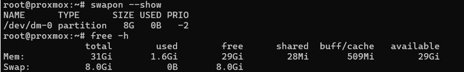
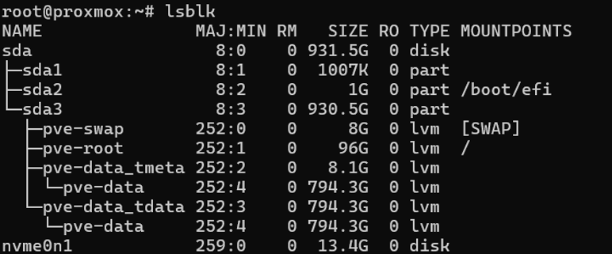
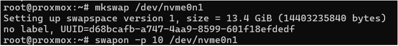
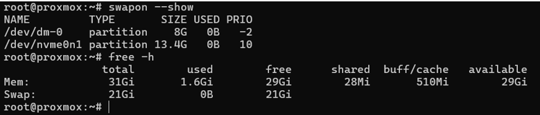
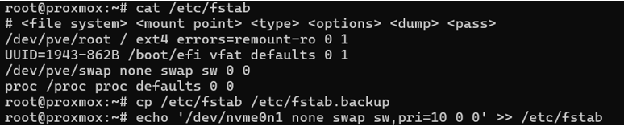
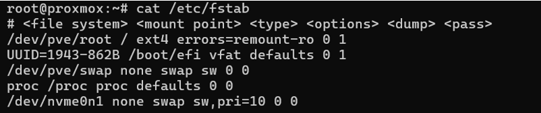

# VM Server Intel NUC i5 (Proxmox)

## A. Optane Configuration

### 1. Using Optane as Swap

The Intel Optane NVMe module (`/dev/nvme0n1`) is configured as **additional swap space** for the Proxmox host.  
This provides extra virtual memory for running multiple VMs/containers and, thanks to Optane’s lower latency compared to the HDD, offers faster swap performance.  
The existing 8 GiB LVM swap is kept, and the Optane swap is given a **higher priority** so the kernel will prefer it.

---

#### 1.1 Checking RAM and existing swap

Before enabling the Optane module, the server only had the default 8 GiB swap on the HDD LVM volume.

```bash
swapon --show
free -h
```



**Figure 1 – Listing swap memory**  
`swapon --show` lists only `/dev/dm-0` (8 GiB) as active swap, and `free -h` confirms a total of 8 GiB swap for the system.

---

#### 1.2 Identifying the Optane NVMe device

The Optane module appears as `/dev/nvme0n1` with a size of ~13.4 GiB and no partitions or filesystem.

```bash
lsblk
```



**Figure 2 – Disk layout with Optane NVMe**  
`lsblk` shows the main HDD (`sda`) hosting the Proxmox LVM volumes and the separate NVMe device `nvme0n1` that will be used entirely as swap.

---

#### 1.3 Creating the swap area on Optane

The Optane device is initialized as swap and then activated with a **higher priority (10)** so the kernel prefers it over the slower HDD swap.

```bash
mkswap /dev/nvme0n1
swapon -p 10 /dev/nvme0n1
```



**Figure 3 – Creating and enabling Optane swap**  
`mkswap` prepares `/dev/nvme0n1` as swap space (13.4 GiB), and `swapon -p 10` activates it with priority 10.

---

#### 1.4 Verifying swap after enabling Optane

After running the previous commands, the system now has both the original LVM swap and the new Optane swap active.

```bash
swapon --show
free -h
```



**Figure 4 – Swap totals with Optane enabled**  
`swapon --show` lists `/dev/dm-0` (8 GiB, priority -2) and `/dev/nvme0n1` (13.4 GiB, priority 10), for a total of 21 GiB swap as confirmed by `free -h`.

---

#### 1.5 Making the Optane swap persistent

To ensure the Optane swap is enabled automatically on every boot, an entry is added to `/etc/fstab`.  
First, the current configuration is reviewed and backed up; then the new swap line is appended.

```bash
cat /etc/fstab
cp /etc/fstab /etc/fstab.backup
echo '/dev/nvme0n1 none swap sw,pri=10 0 0' >> /etc/fstab
cat /etc/fstab
```



**Figure 5 – fstab entry for Optane swap**  
The line `/dev/nvme0n1 none swap sw,pri=10 0 0` is added so the NVMe swap device is mounted automatically with priority 10 after each reboot.

---

#### 1.6 Final verification of persistent swap

After updating `/etc/fstab` (and optionally rebooting), the swap configuration is checked again to confirm that both swap areas are active and that the Optane device keeps the higher priority.

```bash
swapon --show
free -h
```



**Figure 6 – Final Optane swap configuration**  
The system now consistently uses the Optane NVMe (`/dev/nvme0n1`) as high‑priority swap alongside the original 8 GiB LVM swap, providing a total of 21 GiB swap space for Proxmox workloads.
