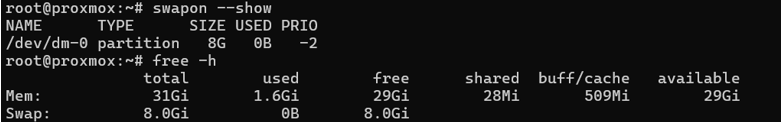
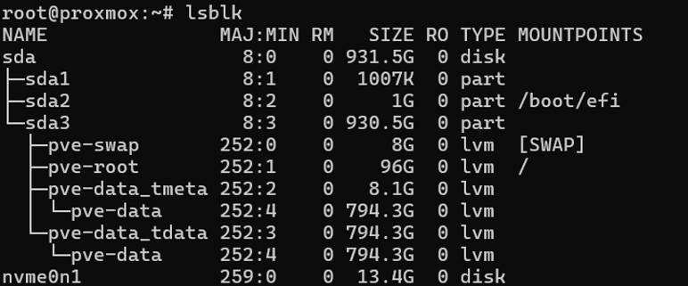
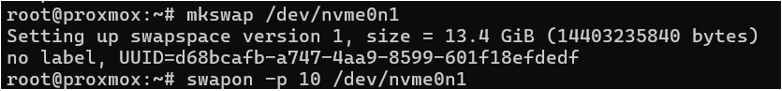
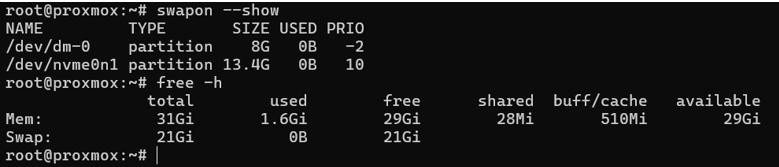
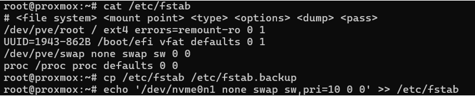
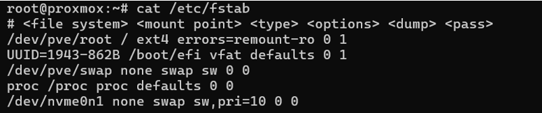
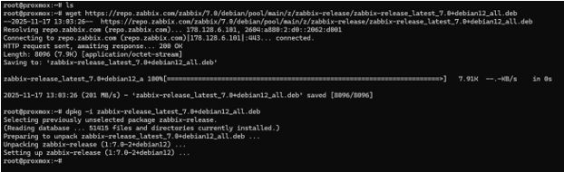
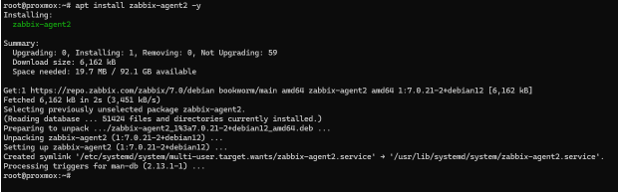
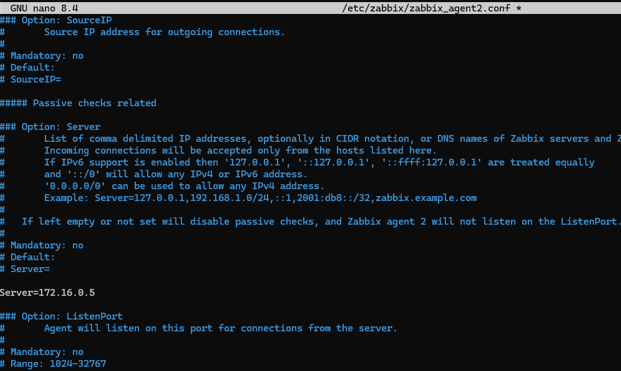
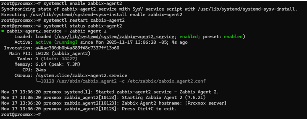

# VM Server Intel NUC i5 (Proxmox)

## A. Optane Configuration

### 1. Using Optane as Swap

The Intel Optane NVMe module (`/dev/nvme0n1`) is configured as **additional swap space** for the Proxmox host.  
This provides extra virtual memory for running multiple VMs/containers and, thanks to Optane’s lower latency compared to the HDD, offers faster swap performance.  
The existing 8 GiB LVM swap is kept, and the Optane swap is given a **higher priority** so the kernel will prefer it.

---

#### 1.1 Checking RAM and existing swap

Before enabling the Optane module, the server only had the default 8 GiB swap on the HDD LVM volume.

```bash
swapon --show
free -h
```



**Figure 1 – Listing swap memory**  
`swapon --show` lists only `/dev/dm-0` (8 GiB) as active swap, and `free -h` confirms a total of 8 GiB swap for the system.

---

#### 1.2 Identifying the Optane NVMe device

The Optane module appears as `/dev/nvme0n1` with a size of ~13.4 GiB and no partitions or filesystem.

```bash
lsblk
```



**Figure 2 – Disk layout with Optane NVMe**  
`lsblk` shows the main HDD (`sda`) hosting the Proxmox LVM volumes and the separate NVMe device `nvme0n1` that will be used entirely as swap.

---

#### 1.3 Creating the swap area on Optane

The Optane device is initialized as swap and then activated with a **higher priority (10)** so the kernel prefers it over the slower HDD swap.

```bash
mkswap /dev/nvme0n1
swapon -p 10 /dev/nvme0n1
```



**Figure 3 – Creating and enabling Optane swap**  
`mkswap` prepares `/dev/nvme0n1` as swap space (13.4 GiB), and `swapon -p 10` activates it with priority 10.

---

#### 1.4 Verifying swap after enabling Optane

After running the previous commands, the system now has both the original LVM swap and the new Optane swap active.

```bash
swapon --show
free -h
```



**Figure 4 – Swap totals with Optane enabled**  
`swapon --show` lists `/dev/dm-0` (8 GiB, priority -2) and `/dev/nvme0n1` (13.4 GiB, priority 10), for a total of 21 GiB swap as confirmed by `free -h`.

---

#### 1.5 Making the Optane swap persistent

To ensure the Optane swap is enabled automatically on every boot, an entry is added to `/etc/fstab`.  
First, the current configuration is reviewed and backed up; then the new swap line is appended.

```bash
cat /etc/fstab
cp /etc/fstab /etc/fstab.backup
echo '/dev/nvme0n1 none swap sw,pri=10 0 0' >> /etc/fstab
cat /etc/fstab
```



**Figure 5 – fstab entry for Optane swap**  
The line `/dev/nvme0n1 none swap sw,pri=10 0 0` is added so the NVMe swap device is mounted automatically with priority 10 after each reboot.

---

#### 1.6 Final verification of persistent swap

After updating `/etc/fstab` (and optionally rebooting), the swap configuration is checked again to confirm that both swap areas are active and that the Optane device keeps the higher priority.

```bash
swapon --show
free -h
```



**Figure 6 – Final Optane swap configuration**  
The system now consistently uses the Optane NVMe (`/dev/nvme0n1`) as high‑priority swap alongside the original 8 GiB LVM swap, providing a total of 21 GiB swap space for Proxmox workloads.


---


## B. Zabbix Agent Configuration

### 1. Installing Zabbix Agent 2 on Proxmox

This Intel NUC i5 runs Proxmox VE on top of Debian and acts as the main hypervisor in the homelab.  
To integrate it into the Zabbix monitoring stack, **Zabbix Agent 2** is installed and configured to report to the DietPi Zabbix server at `172.16.0.5`.

---

#### 1.1 Enabling the Zabbix repository

First, the official Zabbix repository for Debian 12 is added so that the latest agent packages are available via APT.

```bash
wget https://repo.zabbix.com/zabbix/7.0/debian/pool/main/z/zabbix-release/zabbix-release_latest_7.0debian12_all.deb
dpkg -i zabbix-release_latest_7.0debian12_all.deb
```



**Figure 1 – Adding the Zabbix 7.0 repository on Proxmox**  
The `zabbix-release` package drops the appropriate `.list` files under `/etc/apt/sources.list.d/`, allowing Proxmox to install Zabbix components directly from the upstream repository.

---

#### 1.2 Installing the agent package

With the repository configured, the Debian package index is refreshed (if needed) and **Zabbix Agent 2** is installed.

```bash
apt install zabbix-agent2 -y
```



**Figure 2 – Installing Zabbix Agent 2 on Proxmox**  
The package installation also creates a `zabbix-agent2` systemd service, which will later be enabled to start automatically with the hypervisor.

---

### 2. Configuring Zabbix Agent 2

The main configuration file is `/etc/zabbix/zabbix_agent2.conf`.  
As with the backup server, the **Server**, **ServerActive** and **Hostname** parameters are adjusted so the agent can communicate with the central Zabbix server.

---

#### 2.1 Setting server and hostname parameters

```bash
nano /etc/zabbix/zabbix_agent2.conf
```

Relevant lines:

```text
Server=172.16.0.5
ServerActive=172.16.0.5
Hostname=Proxmox server
```



**Figure 3 – Zabbix agent configuration on the Proxmox Server**  
- `Server` lists the IPs allowed to query the agent (passive checks).  
- `ServerActive` defines where the agent should send active check data.  
- `Hostname` must match the host name configured later in the Zabbix web interface (e.g. *Proxmox Server*).

---

### 3. Enabling and starting the agent service

With the configuration saved, the `zabbix-agent2` service is enabled in systemd so it starts at boot, restarted to load the new configuration, and its status is verified.

```bash
systemctl enable zabbix-agent2
systemctl restart zabbix-agent2
systemctl status zabbix-agent2
```



**Figure 4 – Starting and enabling Zabbix Agent 2 on Proxmox**  
The status output confirms that the service is **active (running)** and using `/etc/zabbix/zabbix_agent2.conf`, meaning the hypervisor is now ready to be monitored by the Zabbix server.

---

