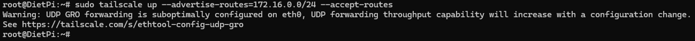
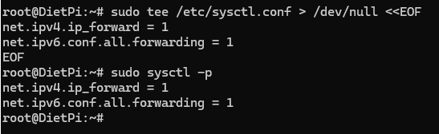
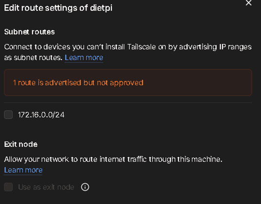

# Monitoring Server Raspberry Pi 3 B+ (DietPi)

## A. Tailscale Configuration

### 1. Using Tailscale for remote access

This Raspberry Pi runs DietPi and acts as the monitoring server for the homelab.  
Tailscale is installed so that any web interface or host inside the lab network can be reached securely over the Tailscale VPN from outside the house.

---

#### 1.1 Installing the Tailscale service

Tailscale is installed from the official script and the service is enabled so it starts automatically on boot.

```bash
sudo apt update
sudo apt install curl -y
curl -fsSL https://tailscale.com/install.sh | sh

sudo systemctl enable tailscaled
sudo systemctl start tailscaled
sudo systemctl status tailscaled
```

- `apt update` / `apt install` prepare the system and install `curl`.
- The `install.sh` script adds the Tailscale repository and installs `tailscaled`.
- `systemctl` is used to enable, start and verify the Tailscale daemon.

---

#### 1.2 Advertising the homelab subnet

After installation, the node is brought online and configured to advertise the LAN subnet `172.16.0.0/24` so other Tailscale devices can reach machines in that network.

```bash
sudo tailscale up
# First-time login in the browser, then:

sudo tailscale up --advertise-routes=172.16.0.0/24 --accept-routes
```



**Figure 1 – Advertising the 172.16.0.0/24 subnet**  
The `tailscale up` command registers the DietPi node, and the second invocation advertises the `172.16.0.0/24` route with `--advertise-routes` and allows receiving routes from other nodes with `--accept-routes`.

---

#### 1.3 Enabling IP forwarding on DietPi

To route traffic between the Tailscale interface and the physical LAN (`eth0`), IP forwarding is enabled for both IPv4 and IPv6.

```bash
sudo tee /etc/sysctl.conf > /dev/null <<EOF
net.ipv4.ip_forward = 1
net.ipv6.conf.all.forwarding = 1
EOF

sudo sysctl -p
```



**Figure 2 – IP forwarding configuration**  
`sysctl.conf` is overwritten with forwarding enabled, and `sysctl -p` reloads the settings so the Raspberry Pi can forward packets between Tailscale and the LAN.

---

#### 1.4 Approving the subnet route in the Tailscale admin console

The advertised route must be approved from the Tailscale admin console before it becomes active.

Steps:

1. Log in to the Tailscale admin panel.
2. Locate the device **dietpi**.
3. Open **Edit route settings**.
4. Check the subnet route `172.16.0.0/24` and save.



**Figure 3 – Approving the advertised subnet route**  
The panel shows that `172.16.0.0/24` is now approved, so other Tailscale clients can reach any host in that subnet via the DietPi router.

---

#### 1.5 Resulting remote access

With Tailscale running, IP forwarding enabled, and the subnet route approved, any device connected to Tailscale can now access homelab services (such as Proxmox, router web GUIs, and monitoring dashboards) by using their LAN addresses in the `172.16.0.0/24` network.
