# Monitoring Server Raspberry Pi 3 B+ (DietPi)

## A. Tailscale Configuration

### 1. Using Tailscale for remote access

This Raspberry Pi runs DietPi and acts as the monitoring server for the homelab.  
Tailscale is installed so that any web interface or host inside the lab network can be reached securely over the Tailscale VPN from outside the house.

---

#### 1.1 Installing the Tailscale service

Tailscale is installed from the official script and the service is enabled so it starts automatically on boot.

```bash
curl -fsSL https://tailscale.com/install.sh | sh

sudo systemctl enable tailscaled
sudo systemctl start tailscaled
sudo systemctl status tailscaled
```

- The `install.sh` script adds the Tailscale repository and installs `tailscaled`.
- `systemctl` is used to enable, start and verify the Tailscale daemon.

---

#### 1.2 Enabling IP forwarding on DietPi

Before advertising the LAN subnet through Tailscale, IP forwarding is enabled so the Raspberry Pi can route packets between the Tailscale interface and the physical LAN (`eth0`).

```bash
sudo tee /etc/sysctl.conf > /dev/null <<EOF
net.ipv4.ip_forward = 1
net.ipv6.conf.all.forwarding = 1
EOF

sudo sysctl -p
```

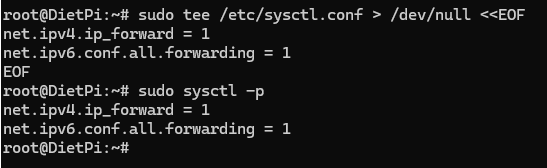

**Figure 1 – IP forwarding configuration**  
`sysctl.conf` is overwritten with forwarding enabled, and `sysctl -p` reloads the settings so the Raspberry Pi can forward traffic between Tailscale and the LAN.

---

#### 1.3 Bringing the node online and advertising the homelab subnet

With forwarding enabled, the node is brought online and configured to advertise the LAN subnet `172.16.0.0/24` so other Tailscale devices can reach machines in that network.

```bash
# First-time login in the browser:
sudo tailscale up

# Then, advertise the homelab subnet:
sudo tailscale up --advertise-routes=172.16.0.0/24 --accept-routes
```

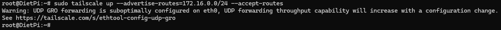

**Figure 2 – Advertising the 172.16.0.0/24 subnet**  
The initial `tailscale up` command registers the DietPi node, and the second invocation advertises the `172.16.0.0/24` route with `--advertise-routes` and allows receiving routes from other nodes with `--accept-routes`.

---

#### 1.4 Approving the subnet route in the Tailscale admin console

The advertised route must be approved from the Tailscale admin console before it becomes active.

Steps:

1. Log in to the Tailscale admin panel.
2. Locate the device **dietpi**.
3. Open **Edit route settings**.
4. Check the subnet route `172.16.0.0/24` and save.

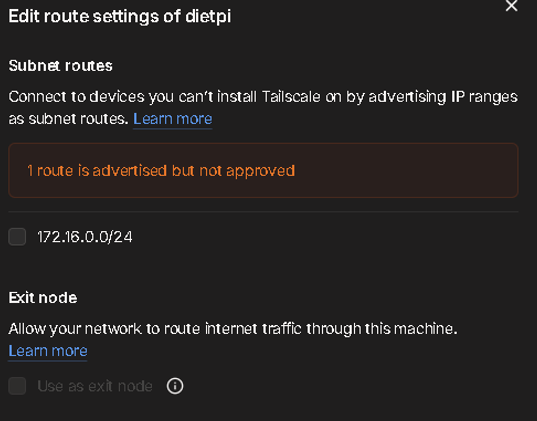

**Figure 3 – Approving the advertised subnet route**  
The panel shows that `172.16.0.0/24` is now approved, so other Tailscale clients can reach any host in that subnet via the DietPi router.

---

#### 1.5 Resulting remote access

With Tailscale running, IP forwarding enabled, and the subnet route approved, any device connected to Tailscale can now access homelab services (such as Proxmox, router web GUIs, and monitoring dashboards) by using their LAN addresses in the `172.16.0.0/24` network.

---

## B. Zabbix Server Configuration

### 1. Installing the Zabbix repository and packages

This section covers adding the official Zabbix repository on DietPi (Debian 13), updating the package lists and installing the Zabbix server, frontend and agent.

---

#### 1.1 Downloading the Zabbix repository package

The Zabbix repository `.deb` package is downloaded into `/root` using `wget`.

```bash
wget https://repo.zabbix.com/zabbix/7.0/debian/pool/main/z/zabbix-release/zabbix-release_7.0-2+debian13_all.deb
```

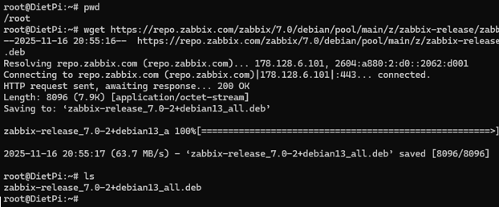

**Figure 4 – Downloading the Zabbix repository package**  
The command downloads `zabbix-release_7.0-2+debian13_all.deb` and the `ls` output confirms the file is present in the current directory.

---

#### 1.2 Installing the Zabbix repository

The downloaded package is installed with `dpkg` so that APT can use the Zabbix repository.

```bash
dpkg -i zabbix-release_7.0-2+debian13_all.deb
```

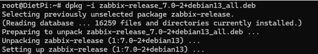

**Figure 5 – Enabling the Zabbix APT repository**  
The system unpacks and sets up the `zabbix-release` package, which adds the Zabbix repository entries under `/etc/apt/sources.list.d/`.

---

#### 1.3 Updating APT indexes

After enabling the repository, the package lists are updated so the new Zabbix packages become available.

```bash
apt update
```

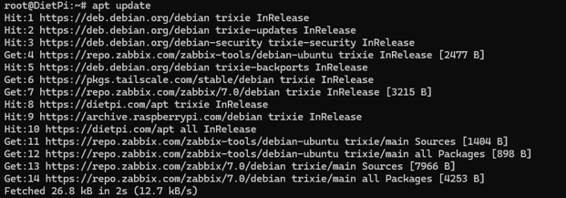

**Figure 6 – Updating package lists**  
The output shows the standard Debian repositories plus the new `repo.zabbix.com` entries for Zabbix 7.0 on Debian Trixie.

---

#### 1.4 Installing Zabbix server, frontend and agent

With the repository configured, the Zabbix components and MariaDB server are installed in a single command.

```bash
apt install -y \
  mariadb-server \
  zabbix-server-mysql \
  zabbix-frontend-php \
  zabbix-apache-conf \
  zabbix-sql-scripts \
  zabbix-agent2
```

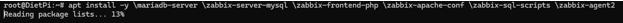

**Figure 7 – Installing Zabbix and MariaDB packages**  
This installs the database server, Zabbix server daemon (MySQL/MariaDB backend), the PHP frontend with Apache integration, the SQL schema scripts and the Zabbix Agent 2.

---

### 2. Securing the MariaDB server

Before creating the Zabbix database, the MariaDB instance is hardened using the `mariadb-secure-installation` helper.

```bash
mariadb-secure-installation
```

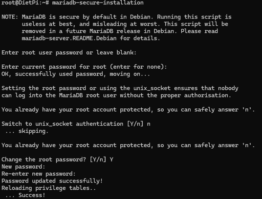

**Figure 8 – Initial MariaDB secure installation steps**  
During the wizard, a root password is set and Unix socket authentication options are confirmed according to the prompts.

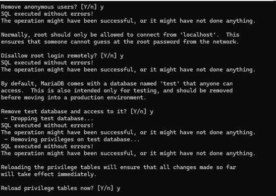

**Figure 9 – Removing test database and tightening access**  
Anonymous users are removed, remote root login is disabled, the default `test` database is dropped and the privilege tables are reloaded to apply the changes.

---

### 3. Creating the Zabbix database and user

Once MariaDB is secured, the database and user for Zabbix are created.  
First, the MariaDB shell is opened as root:

```bash
mariadb -u root -p
```

Inside the MariaDB prompt, the following SQL statements are executed:

```sql
CREATE DATABASE zabbix
  CHARACTER SET utf8mb4
  COLLATE utf8mb4_bin;

CREATE USER 'zabbix'@'localhost'
  IDENTIFIED BY '';

GRANT ALL PRIVILEGES ON zabbix.* TO 'zabbix'@'localhost';

FLUSH PRIVILEGES;
EXIT;
```

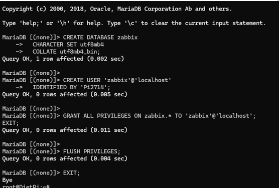

**Figure 10 – Creating the Zabbix database and granting privileges**  
The database `zabbix` is created with UTF-8 settings, a local user `zabbix` is defined with an (initially) empty password, and full privileges on the `zabbix` schema are granted. In a real deployment, a strong password should be configured instead of an empty value.

---

### 4. Importing the initial Zabbix schema

Zabbix provides a pre-built schema and data file in compressed form.  
It is imported into the `zabbix` database using `zcat` piped into `mariadb`:

```bash
zcat /usr/share/zabbix-sql-scripts/mysql/server.sql.gz \
  | mariadb -u zabbix -p zabbix
```

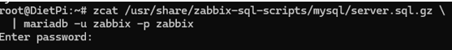

**Figure 11 – Importing the Zabbix SQL schema**  
The command expands `server.sql.gz` and feeds it directly to MariaDB, populating all required tables and initial data in the `zabbix` database.

---

### 5. Configuring the Zabbix server to use MariaDB

The Zabbix server configuration file is edited so the daemon knows how to connect to the MariaDB instance.

```bash
nano /etc/zabbix/zabbix_server.conf
```

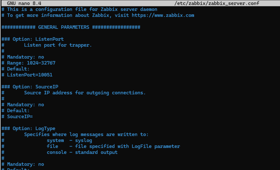

**Figure 12 – Zabbix server configuration file**  
The file `/etc/zabbix/zabbix_server.conf` contains the main server parameters, including database connection options.

In the database section, the `DBUser` and `DBPassword` parameters are set to match the MariaDB user created earlier. For documentation purposes, the password field is left empty:

```text
DBUser=zabbix
DBPassword=
```

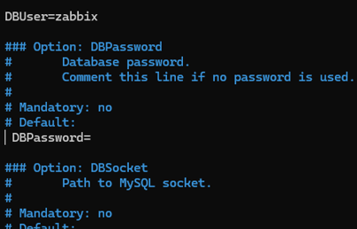

**Figure 13 – Database credentials in zabbix_server.conf**  
`DBUser` is already set to `zabbix` by default; only `DBPassword` needs to be uncommented. A real deployment should use a strong password here and in the corresponding MariaDB user configuration.

---

### 6. Starting and enabling Zabbix services

Once the database configuration is complete and `zabbix_server.conf` points to the correct credentials, the web server and Zabbix daemons are restarted and enabled to start on boot.

---

#### 6.1 Restarting Apache

After installing the PHP frontend, Apache is restarted so it loads the Zabbix virtual host and PHP configuration.

```bash
systemctl restart apache2
```

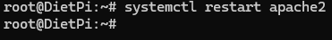

**Figure 14 – Restarting Apache after Zabbix frontend installation**

---

#### 6.2 Restarting and checking the Zabbix server

```bash
systemctl restart zabbix-server
systemctl status zabbix-server
```

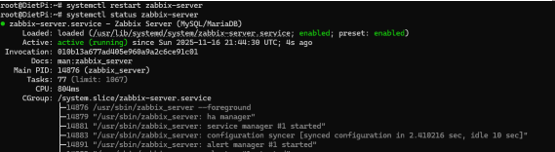

**Figure 15 – Verifying that the Zabbix server is running**

---

#### 6.3 Restarting and checking the Zabbix Agent 2

```bash
systemctl restart zabbix-agent2
systemctl status zabbix-agent2
```

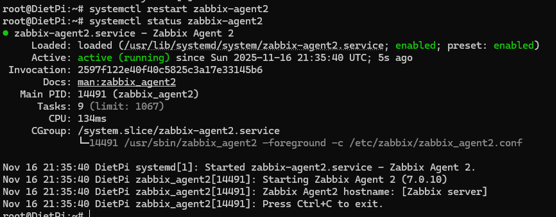

**Figure 16 – Verifying that Zabbix Agent 2 is running**

---

#### 6.4 Enabling services on boot

```bash
systemctl enable zabbix-server zabbix-agent2 apache2 mariadb
```

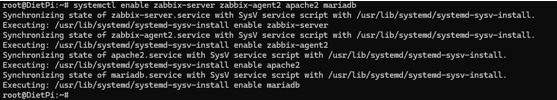

**Figure 17 – Enabling Zabbix-related services at boot**

---

### 7. Initial Zabbix web configuration

With all services running, the first login to the Zabbix web interface completes the installation through a guided wizard.

---

#### 7.1 Welcome screen and language selection

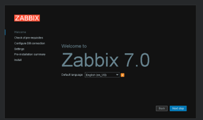

**Figure 18 – Zabbix 7.0 installer welcome page**

---

#### 7.2 Checking PHP pre-requisites

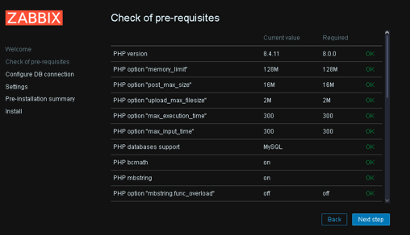

**Figure 19 – PHP prerequisites check**

---

#### 7.3 Configuring the database connection

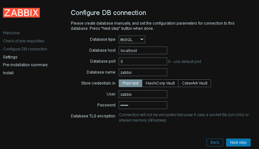

**Figure 20 – Database connection parameters**

---

#### 7.4 Setting server details and time zone

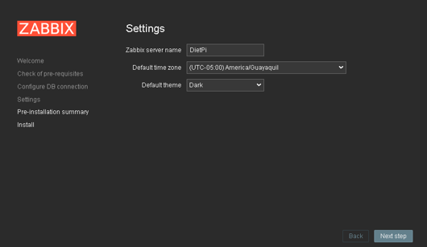

**Figure 21 – Zabbix server general settings**

---

#### 7.5 Pre-installation summary

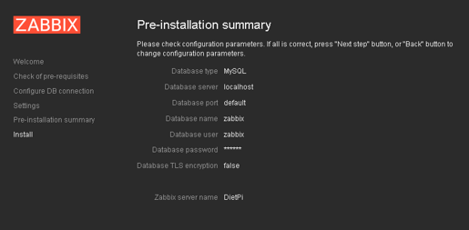

**Figure 22 – Pre-installation configuration summary**

---

### 8. Post‑installation configuration: Housekeeping and dashboard verification

After completing the initial setup, Zabbix provides several administrative options to control database growth, data retention, and overall system behavior. One of the recommended steps is to verify **Housekeeping** settings and confirm that the system dashboard loads correctly.

---

### 8.1 Accessing Housekeeping settings

Housekeeping controls how long Zabbix stores historical data, events, and internal logs.  
To access it:

**Administration → Housekeeping**

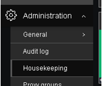

**Figure 23 – Navigating to Housekeeping settings**  
This menu contains retention periods for events, alerts, services, user sessions and discovery data.

---

### 8.2 Reviewing default data retention periods

The Housekeeping page displays multiple retention values, which can be customized depending on storage capacity and required historical depth.

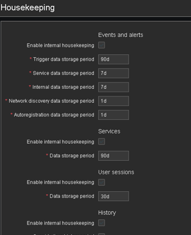

**Figure 24 – Default Housekeeping retention values**  
By default, Zabbix stores events (90 days), service data (7 days), internal data (7 days), discovery results (1 day) and user sessions (30 days). Lowering these values can reduce database size on small systems like Raspberry Pi.

---

### 9. Verifying system status on the global dashboard

Once the installation is complete, Zabbix loads the **Global view** dashboard, summarizing metrics such as host availability, event counts, CPU usage, and server health.

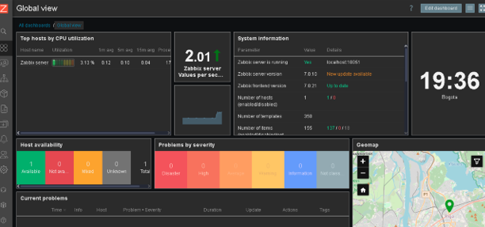

**Figure 25 – Zabbix Global Dashboard after installation**  
The dashboard confirms:
- Zabbix server is running  
- Frontend is operational  
- Hosts are being monitored  
- Basic telemetry (CPU, availability, problems by severity) is functional  

This indicates the installation and configuration were successful.

---

### 10. Adding monitored hosts to Zabbix

Once the Zabbix server and dashboard are fully operational, the next step is to add the homelab servers as monitored hosts.  
**This assumes the Zabbix Agent 2 is already installed and running on each server**, as documented in:

- [homelab-core-rack/server-backup-nuc-celeron/](../server-backup-nuc-celeron/)
- [homelab-core-rack/server-proxmox-nuc-i5/](../server-proxmox-nuc-i5/)

---

### 10.1 Adding the Backup Server (Intel NUC Celeron)

To register the Backup Server in Zabbix:

1. Go to **Configuration → Hosts → Create host**.
2. Enter the hostname and visible name (for example, `Backup Server`).
3. Add the template **Linux by Zabbix agent**.
4. Assign the host to the **Linux servers** group.
5. Add an Agent interface pointing to the LAN IP of the backup NUC (e.g. `172.16.0.3`) on port **10050**.

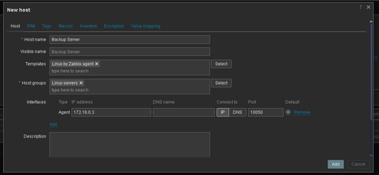

**Figure 26 – Creating the Backup Server host entry**  
The backup server is added with the standard Linux agent template, which provides OS-level metrics such as CPU, memory, filesystem usage, and basic networking.

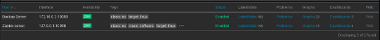

**Figure 27 – Backup Server monitored successfully**  
Once the agent responds, the host status changes to **Available**, and Zabbix starts collecting metrics and populating items, triggers, and graphs for this server.

---

### 10.2 Adding the Proxmox Server (Intel NUC i5)

The same process is used to add the Proxmox hypervisor:

1. Go to **Configuration → Hosts → Create host**.
2. Set the hostname and visible name (for example, `Proxmox Server`).
3. Add the template **Linux by Zabbix agent**.
4. Assign the host to the **Hypervisors** group.
5. Configure the Agent interface with the Proxmox LAN IP (e.g. `172.16.0.4`) on port **10050**.

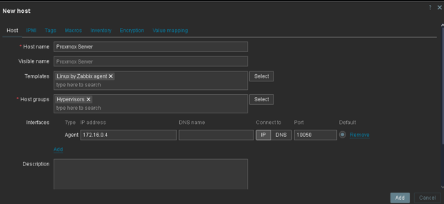

**Figure 28 – Creating the Proxmox Server host entry**  
Grouping the Proxmox node under *Hypervisors* keeps virtualization infrastructure separated from generic Linux servers in the Zabbix UI.

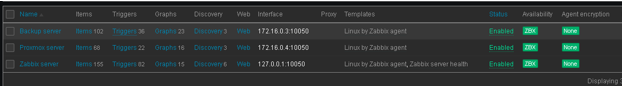

**Figure 29 – Proxmox Server monitored successfully**  
After the agent connection is established, the Proxmox host also appears as **Available**, confirming that the Zabbix server can reach and monitor the hypervisor over the homelab network.

---

