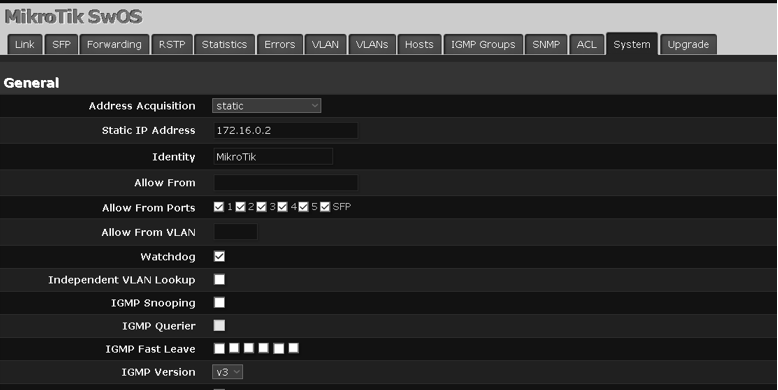
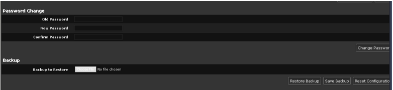

# Switch MikroTik RB260GS (SwOS)

## A. Basic Configuration

### 1. General configuration

#### 1.1 Initial login using web browser

Unlike the hEX router (which is managed with **WinBox**), the RB260GS runs **SwOS** and is configured entirely through a **web browser**.  

For the first login, a laptop is connected to one of the switch ports (for example, **port 1**) and the browser is pointed to the switch’s default management IP address (as indicated in the vendor documentation).  
The login is done with the factory default credentials, which are then immediately changed in the **System** tab for security.

---

#### 1.2 Setting a static management IP and allowed ports

Once inside the SwOS interface, the **System → General** page is used to define how the switch obtains its management address and from which ports it can be accessed.

**Figure 1 – SwOS general settings**  
The **Address Acquisition** mode is changed from automatic (DHCP) to **static**, and the switch is assigned the management IP **172.16.0.2**.  
The option **Allow From Ports** is set so that all copper ports (**1–5**) and the **SFP** port are allowed to reach the management interface, ensuring that the switch can be administered from any link in the homelab LAN. Other advanced options on this page (Watchdog, IGMP, VLAN lookup, etc.) are left at their default values for this basic setup.

---

#### 1.3 Securing access credentials and backup

At the bottom of the same **System** page, SwOS provides a section to change the admin password and manage configuration backups.

**Figure 2 – Password and backup configuration**  
The factory default password is replaced with a strong custom password in the **Password Change** section.  
Below, the **Backup** section is used to download a copy of the running configuration once the initial setup is complete, so that the switch can be quickly restored or cloned in case of lab changes or failures.
